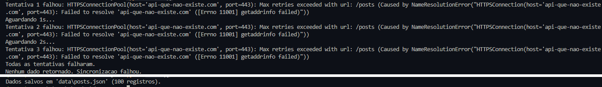

# Data Sync

Python automation that fetches data from an API and saves it locally with exponential backoff retry logic.

## Stack
- Python
- Requests
- python-dotenv

## How it works
1. Fetches data from a REST API
2. If the request fails, retries up to 3 times
3. Wait time doubles on each retry: 1s → 2s → 4s
4. Saves the response as a JSON file locally

## How to run
1. Clone the repository
2. Install dependencies: `pip install -r requirements.txt`
3. Run: `python main.py`

## Demo

